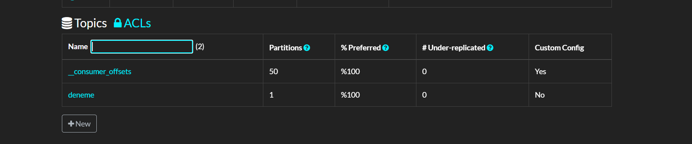
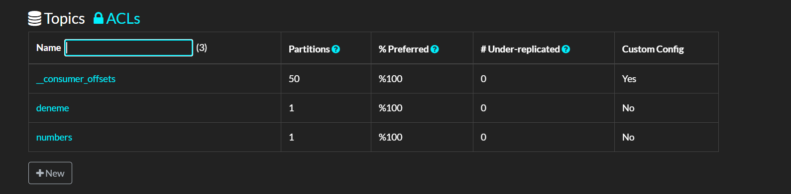
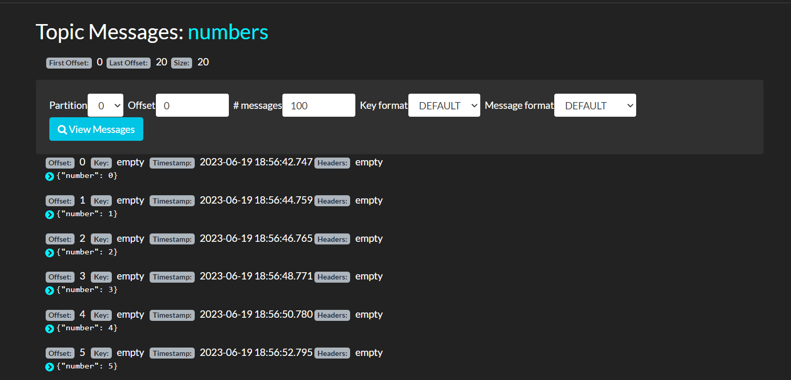

# Kafka-MongoDB-CDC-App

- It is a basic Kafka- MongoDB Producer-Consumer Example.
- Also it has docker-compose file. 
- In this system, when producer start producing, it is produce some sample number data every 10 minutes.

## Available Scripts

- In the project directory, you can run with use Docker-Compose file:

### `docker-compose up -d` for start the whole system

- If you want to check Kafdrop interface for produce data and control topics:

### [http://localhost:9003/](http://localhost:9003/)

- If you want to check Mongo Express DB interface for produce check datas and table:

### [http://localhost:8081/](http://localhost:8081/)

- Example screens for sample number datas on Kafdrop in the first screen:

- After start the producer & consumer in few minutes, the screen will change like:

- When we click "view messages" in Numbers topic, we can see which data add into Numbers table in MongoDB:

